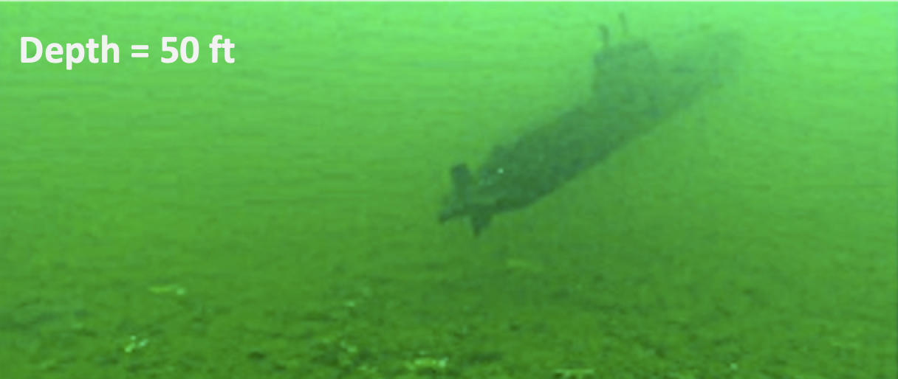

# Automated-Weather-Detector

Detect weather based on image pixel values. Fog / Haze / Underwater / Daytime / Nighttime / Cloudy / etc...

## Night Level / Haze Level

The level of night is calculated by converting the image / frame to greyscale and computing the average pixel intensity value. Haze is computed the same way, but the average pixel intensity value is much higher (towards 255) for high amounts of fog and much lower (towards 0) for night. Daytime is typically in the middle for average pixel intensity value.

## Underwater

The depth underwater can be computed by measuring the average intensity value of pixels, but only in the red channel. This is because red light has the longest wavelength and is blocked first by the water. Underwater images lack red channel and appear blue / green the deeper you go.

## Automated and Localized Gamma / Color Correction

Two routines to adjust / enhance the image to gain a higher quality.
